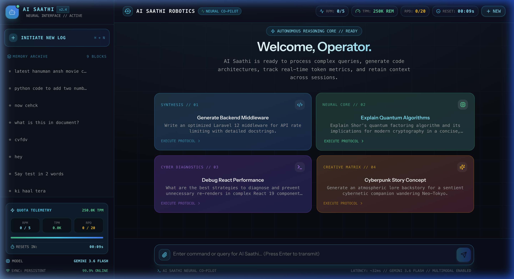

# 🤖 AI Saathi — Futuristic Robotics AI Co-Pilot

[](https://laravel.com)
[](https://react.dev)
[](https://inertiajs.com)
[](https://aistudio.google.com)
[](https://tailwindcss.com)

**AI Saathi** is an advanced, high-performance robotic AI co-pilot powered by **Laravel 12**, **React 19**, **Inertia.js**, and **Google Gemini 3.6 Flash** via Laravel's first-party AI SDK (`laravel/ai`). Designed with a futuristic cyber-telemetry HUD interface, persistent multi-turn memory, multimodal file attachments, autonomous tool execution, and live quota tracking.

---

<p align="center">
  
</p>

---

## ⚡ Key Features

- **🌐 Cyber Telemetry Cockpit UI**:
  - Futuristic dark aesthetic with animated holographic iris, glowing neural core, and real-time status telemetry.
  - Interactive protocol trigger cards for instant execution of coding, diagnostics, math, and creative tasks.
  
- **🧠 Multi-Turn Memory Persistence**:
  - Automatically remembers multi-turn conversational context in MySQL via `Laravel\Ai\Concerns\RemembersConversations`.
  - Sidebar mission memory archive with one-click log switching, timestamps, and memory purge capabilities.

- **📊 Real-Time Token & Quota Telemetry**:
  - **Per-Message Telemetry**: Live prompt tokens, completion tokens, and reasoning tokens tracked for every response.
  - **Live Google AI Studio Rate Gauges**: Real-time HUD meters for **RPM (Requests Per Minute)**, **TPM (Tokens Per Minute)**, and **RPD (Requests Per Day)**.
  - **60-Second Window Countdown**: Live countdown timer showing when the rate window resets to avoid `HTTP 429` errors.

- **📎 Multimodal Payloads & File Attachments**:
  - Supports image uploads (`.png`, `.jpg`, `.webp`) and document attachments (`.pdf`, `.txt`, `.md`, `.json`, `.csv`, `.js`, `.py`, `.php`, `.ts`).
  - Staged file dock with image previews, formatted file sizes, and instant removal.
  - Interactive thumbnail rendering and file chips directly within user chat bubbles.

- **🛠️ Autonomous Tool Calling**:
  - Equipped with `Laravel\Ai\Contracts\HasTools`:
    - **`WebSearch`**: Google Search grounding for real-time web intelligence.
    - **`SystemInfoTool`**: Real-time timestamps, local dates, and timezone telemetry.
    - **`CalculatorTool`**: Precision arithmetic and mathematical expression evaluation.

- **💻 Syntax-Highlighted Markdown**:
  - Full Markdown support powered by `react-markdown` and `remark-gfm`.
  - VS Code Dark+ theme code blocks via `react-syntax-highlighter` (Prism) with one-click copy buttons and language badges.

- **🛡️ Diagnostic Error Handling**:
  - Gracefully captures API rate limits, Google Quota exhaustion, and network exceptions, returning clear diagnostics to the operator.

---

## 🏗️ Tech Stack & Architecture

- **Backend Framework**: [Laravel 12](https://laravel.com) (PHP 8.3+)
- **AI Engine**: [Laravel AI SDK (`laravel/ai`)](https://github.com/laravel/ai) configured with **Google Gemini 3.6 Flash** (`gemini-3.6-flash`)
- **Frontend Layer**: [React 19](https://react.dev) + [Inertia.js 3](https://inertiajs.com) + [Vite](https://vitejs.dev)
- **Styling & UI**: Tailwind CSS 4 + [Lucide Icons](https://lucide.dev)
- **Database**: MySQL (`agent_conversations` & `agent_conversation_messages`)
- **State & Caching**: Laravel Cache Store (file / redis / database) for rate-limit telemetry

---

## 🚀 Getting Started

### 1. Prerequisites

- **PHP 8.3+** with `bcmath`, `curl`, `mbstring`, `pdo_mysql`
- **Composer 2+**
- **Node.js 20+** & **npm**
- **MySQL 8.0+**
- **Google Gemini API Key** from [Google AI Studio](https://aistudio.google.com/)

### 2. Installation

Clone the repository:
```bash
git clone https://github.com/your-username/ai_saathi.git
cd ai_saathi
```

Install backend dependencies:
```bash
composer install
```

Install frontend dependencies:
```bash
npm install
```

### 3. Environment Configuration

Copy the example environment file:
```bash
cp .env.example .env
```

Generate application key:
```bash
php artisan key:generate
```

Configure your `.env` file with database credentials and your **Gemini API Key**:

```env
APP_NAME="AI Saathi"
APP_ENV=local
APP_DEBUG=true
APP_URL=http://localhost:8000

# Database Configuration
DB_CONNECTION=mysql
DB_HOST=127.0.0.1
DB_PORT=3306
DB_DATABASE=ai_saathi
DB_USERNAME=root
DB_PASSWORD=

# Laravel AI & Google Gemini Configuration
AI_DEFAULT_PROVIDER=gemini
GEMINI_API_KEY=your_gemini_api_key_here
GEMINI_MODEL=gemini-3.6-flash

# Quota & Rate Limit Calibration (Google AI Studio Tier)
GEMINI_RPM_LIMIT=5
GEMINI_TPM_LIMIT=250000
GEMINI_RPD_LIMIT=20
```

### 4. Database Setup & Migrations

Run database migrations to initialize conversation memory tables:
```bash
php artisan migrate
```

### 5. Running the Application

Start the Laravel backend development server:
```bash
php artisan serve
```

In a separate terminal, start the Vite development server:
```bash
npm run dev
```

Visit **`http://localhost:8000`** in your browser.

---

## 🛰️ API & Route Reference

| Method | Endpoint | Description |
|---|---|---|
| `GET` | `/` | Main AI Saathi futuristic web cockpit |
| `POST` | `/api/chat` | Multimodal conversational endpoint with attachment parsing and tool execution |
| `GET` | `/api/quota` | Telemetry statistics for RPM, TPM, RPD, and reset window countdown |
| `GET` | `/api/conversations` | Lists all stored conversation memory blocks |
| `GET` | `/api/conversations/{id}` | Retrieves full message history and per-message token logs |
| `DELETE` | `/api/conversations/{id}` | Purges a conversation memory block and its messages |

---

## 📂 Project Structure

```
ai_saathi/
├── app/
│   └── Ai/
│       ├── Agents/
│       │   └── SaathiAgent.php       # Conversational Agent with tools and Gemini 3.6 model
│       └── Tools/
│           ├── CalculatorTool.php    # Mathematical evaluation tool
│           └── SystemInfoTool.php    # Real-time timestamp & timezone tool
├── config/
│   └── ai.php                        # Laravel AI SDK provider & model mappings
├── resources/
│   ├── js/
│   │   ├── pages/
│   │   │   └── welcome.tsx           # Full robotics telemetry cockpit & chat interface
│   │   ├── app.tsx                   # Inertia application bootstrap
│   │   └── lib/                      # Utilities
│   └── views/
│       └── app.blade.php             # Master Blade layout
└── routes/
    └── web.php                       # API endpoints and conversational controller logic
```

---

## 📜 License

This project is open-sourced under the [MIT License](LICENSE).
